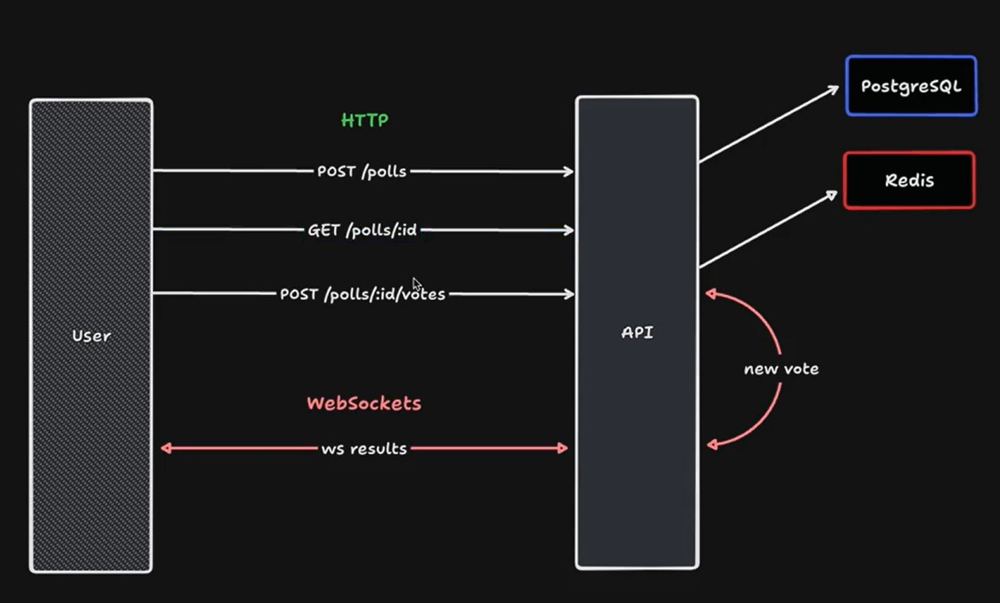

<div align="center"> 
  <a href="https://www.rocketseat.com.br/eventos/nlw/">
    
  </a>
</div>

# NLW Expert (NodeJS) 

<div align="center"> 
  
</div>

## Project

This project was developed as part of the NLW Expert event organized by Rocketseat. It is an API for a real-time voting system where users can create polls and cast their votes.
The system dynamically generates a ranking among the poll options and updates the votes in real-time.

## Project Diagram



## Features

- Users can create polls;
- Community members can vote on polls;
- Real-time updating of votes and ranking;
- API-based architecture for easy integration;

## Requirements

- Docker;
- NodeJS;

## Setup

- Clone the repository

```bash
git clone https://github.com/alexandrecpedro/real-time-voting-system.git
```

- Install dependencies

```bash
 npm install
```

- Setup PostgreSQL and Redis

```bash
 docker compose up -d
```

- Copy `.env.example` file

```bash
 cp .env.example .env
```

- Run application

```bash
 npm run dev
```

- Test it!
  - [Hoppscotch](https://hoppscotch.io/).
  - [Postman](https://www.postman.com/).

## HTTP

### POST `/polls`

Create a new poll.

#### Request body

```json
{
  "title": "Qual a melhor linguagem de programação?",
  "options": ["JavaScript", "Java", "PHP", "C#"]
}
```

#### Response body

```json
{
  "pollId": "194cef63-2ccf-46a3-aad1-aa94b2bc89b0"
}
```

### GET `/polls/:pollId`

Return data from a single poll.

#### Response body

```json
{
  "poll": {
    "id": "e4365599-0205-4429-9808-ea1f94062a5f",
    "title": "Qual a melhor linguagem de programação?",
    "options": [
      {
        "id": "4af3fca1-91dc-4c2d-b6aa-897ad5042c84",
        "title": "JavaScript",
        "score": 1
      },
      {
        "id": "780b8e25-a40e-4301-ab32-77ebf8c79da8",
        "title": "Java",
        "score": 0
      },
      {
        "id": "539fa272-152b-478f-9f53-8472cddb7491",
        "title": "PHP",
        "score": 0
      },
      {
        "id": "ca1d4af3-347a-4d77-b08b-528b181fe80e",
        "title": "C#",
        "score": 0
      }
    ]
  }
}
```

### POST `/polls/:pollId/votes`

Add a vote to specific poll.

#### Request body

```json
{
  "pollOptionId": "31cca9dc-15da-44d4-ad7f-12b86610fe98"
}
```

## WebSockets

### ws `/polls/:pollId/results`

Number of votes of one poll.

### Message

```json
{
  "pollOptionId": "da9601cc-0b58-4395-8865-113cbdc42089",
  "votes": 2
}
```
